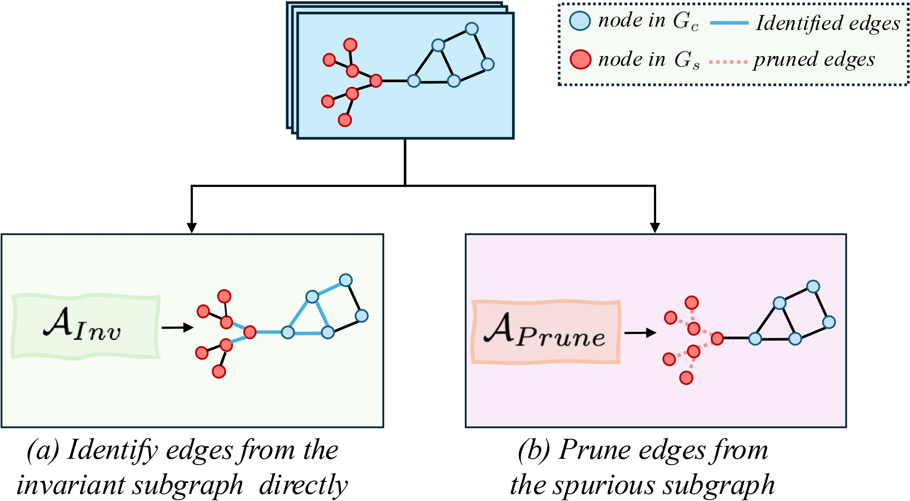

# PrunE: Pruning Spurious Subgraphs for Graph Out-of-Distribution Generalization

[](https://arxiv.org/abs/2506.05957)
[](LICENSE)
[](https://www.python.org/downloads/)
[](https://pytorch.org/)

> **Official PyTorch implementation of "Pruning Spurious Subgraphs for Graph Out-of-Distribution Generalization"**
>
> [Tianjun Yao](https://tianyao-aka.github.io/)<sup>1</sup>, [Haoxuan Li](https://haoxuanli-pku.github.io/)<sup>1</sup>, [Yongqiang Chen](https://yongqiang-chen.github.io/)<sup>1,2</sup>, [Tongliang Liu](https://tongliang-liu.github.io/)<sup>3,1</sup>, [Le Song](https://scholar.google.com/citations?user=Xl4E0CsAAAAJ)<sup>1</sup>, [Eric Xing](https://www.cs.cmu.edu/~epxing/)<sup>1,2</sup>, [Zhiqiang Shen](https://zhiqiangshen.com/)<sup>1</sup>
>
> <sup>1</sup>Mohamed bin Zayed University of AI, <sup>2</sup>Carnegie Mellon University, <sup>3</sup>The University of Sydney
>
> ***NeurIPS 2025***


---


## 🎯 Overview

Graph Neural Networks (GNNs) often suffer from significant performance degradation under distribution shifts. While existing methods attempt to **directly identify invariant subgraphs**, we propose **PrunE**, which takes a complementary approach by **pruning spurious edges** to preserve invariant structures more effectively.

<p align="center">
  
</p>

**Key Insight**: While some spurious edges strongly correlate with labels, the majority are uninformative and easier to identify due to weak correlations. By pruning these uninformative edges, PrunE naturally preserves the invariant subgraph through ERM's inductive bias, achieving superior OOD generalization.

### Why Pruning Works Better

From our case study on GOOD-Motif dataset:

<p align="center">
  
</p>

- **Previous methods** (GSAT, CIGA, AIA) directly identify invariant edges but often misclassify edges in G_c with low probabilities
- **PrunE** preserves ~**9/10 invariant edges** vs. ~5/10 for baselines by focusing on removing spurious edges
- Even with some spurious edges remaining, better preservation of G_c leads to **24.19% performance improvement**

---

## 🚀 Key Contributions

### 1. Novel Pruning-Based Framework

First graph OOD method that focuses on **removing spurious edges** rather than directly identifying invariant ones, leading to more comprehensive preservation of invariant substructures.

### 2. Two Lightweight Regularization Terms

**Graph Size Constraint** ($\mathcal{L}_e$):

$$\mathcal{L}_e = \mathbb{E}_G \left[\left(\frac{\sum_{(i,j)\in E} \tilde{A}_{ij}}{|E|} - \eta\right)^2\right]$$

Excludes uninformative spurious edges by limiting total edge weights to $\eta|G|$, where $\eta \in \{0.5, 0.75, 0.85\}$.

**ε-Probability Alignment** ($\mathcal{L}_s$):

$$\mathcal{L}_s = \mathbb{E}_G \left[\frac{1}{|\mathcal{E}_s|} \sum_{e_{ij}\in\mathcal{E}_s} |p_{ij} - \epsilon|\right]$$

Suppresses spurious edge occurrence by aligning lowest $K\%$ edge probabilities to $\epsilon = \frac{1}{|E|}$.

**Final Objective**:

$$\mathcal{L} = \mathcal{L}_{GT} + \lambda_1\mathcal{L}_e + \lambda_2\mathcal{L}_s$$

---

## 💻 Installation

### Requirements

- Python ≥ 3.8
- PyTorch ≥ 2.1.2
- PyTorch Geometric ≥ 2.4.0
- CUDA 12.1 (recommended for GPU support)

### Setup

```bash
# Clone the repository
git clone https://github.com/tianyao-aka/PrunE-GraphOOD.git
cd PrunE-GraphOOD

# Create conda environment
conda create -n prune python=3.8
conda activate prune

# Install PyTorch (adjust CUDA version as needed)
pip install torch==2.1.2 torchvision torchaudio --index-url https://download.pytorch.org/whl/cu121

# Install PyTorch Geometric
pip install torch-geometric==2.4.0

# Install other dependencies
pip install numpy==1.24.4 ogb==1.3.6

# Install GOOD benchmark dependencies (optional, for dataset loading)
# Follow instructions at: https://good.readthedocs.io/en/latest/installation.html
```

---

## ⚡ Quick Start

### Training on GOOD-Motif (Base Split)

```bash
python run.py --device 0 --batch_size 64 --dataset goodmotif --domain basis --shift covariate \
    --base_gnn gin --early_stop_epochs 50 --nhid 128 --epochs 100 --pretraining_epochs 10 \
    --nlayers 4 --edge_gnn_layers 2 --edge_gnn gin \
    --edge_uniform_penalty 0.001 --edge_prob_thres 90 --edge_budget 0.85 --edge_penalty 10 \
    --seed 1 --with_bn --dropout 0.0
```

### Training on GOOD-HIV (Scaffold Split)

```bash
python run.py --device 0 --batch_size 64 --dataset goodhiv --domain scaffold --shift covariate \
    --base_gnn gin --early_stop_epochs 50 --nhid 128 --epochs 100 --pretraining_epochs 10 \
    --nlayers 4 --edge_gnn_layers 2 --edge_gnn gin --mol_encoder \
    --edge_uniform_penalty 0.001 --edge_prob_thres 50 --edge_budget 0.75 --edge_penalty 10 \
    --seed 1 --with_bn --dropout 0.0
```

### Training on OGBG-Molbbbp (Scaffold Split)

```bash
python run.py --device 0 --batch_size 64 --dataset molbbbp --domain scaffold --shift covariate \
    --base_gnn gin --early_stop_epochs 50 --nhid 64 --epochs 100 \
    --nlayers 4 --edge_gnn_layers 2 --edge_gnn gin --mol_encoder \
    --edge_uniform_penalty 0.01 --edge_prob_thres 50 --edge_budget 0.85 --edge_penalty 10 \
    --seed 1 --with_bn --dropout 0.0
```

### Key Arguments

| Argument | Description | Paper Notation | Recommended Values |
|----------|-------------|----------------|-------------------|
| `--edge_budget` | Edge budget ratio | η in ℒ_e | {0.5, 0.75, 0.85} |
| `--edge_prob_thres` | Percentage of lowest probability edges | K in ℒ_s | {50, 70, 90} |
| `--edge_penalty` | Weight for graph size constraint | λ₁ | {10, 40} |
| `--edge_uniform_penalty` | Weight for ε-probability alignment | λ₂ | {0.001, 0.01, 0.1} |
| `--edge_gnn` | Subgraph selector architecture | t(·) | {gin, gcn} |
| `--edge_gnn_layers` | Number of layers in t(·) | - | {2, 3} |
| `--mol_encoder` | Use molecular encoders (for GOODHIV/OGBG) | - | flag |

### Domain Options

- **GOOD-Motif**: `--domain basis` or `--domain size`
- **GOOD-HIV**: `--domain scaffold` or `--domain size`
- **OGBG datasets**: `--domain scaffold` or `--domain size`


---

## 📖 Citation

If you find this work useful, please cite our paper:

```bibtex
@inproceedings{yao2025prune,
  title={Pruning Spurious Subgraphs for Graph Out-of-Distribution Generalization},
  author={Yao, Tianjun and Li, Haoxuan and Chen, Yongqiang and Liu, Tongliang and Song, Le and Xing, Eric and Shen, Zhiqiang},
  booktitle={Advances in Neural Information Processing Systems},
  year={2025}
}
```


